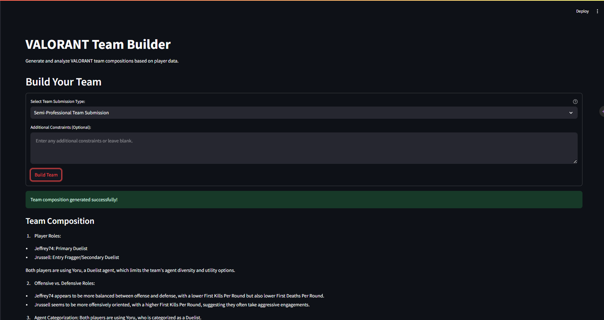

# VALORANT Team Builder


**VALORANT Team Builder** is a powerful web-based application designed to help VALORANT players form balanced and strategic teams. By leveraging comprehensive player performance metrics, agent selections, organizational affiliations, and regional diversity, the app generates optimized team compositions tailored for various competitive scenarios. Integrated with OpenAI's GPT-4 and AWS Bedrock Agent Runtime, VALORANT Team Builder ensures that each team is not only balanced on paper but also tactically sound.

## Table of Contents

- [Features](#features)
- [Demo](#demo)
- [Installation](#installation)
- [Configuration](#configuration)
- [Usage](#usage)
- [Database Setup](#database-setup)
- [Environment Variables](#environment-variables)
- [Deployment](#deployment)
- [Contributing](#contributing)
- [License](#license)
- [Contact](#contact)

## Features

- **Team Submission Types**: Choose from Professional, Semi-Professional, Game Changers, Mixed-Gender, Cross-Regional, and Rising Star team submissions.
- **Comprehensive Player Metrics**: Utilizes detailed player statistics to inform team composition.
- **AI-Driven Team Composition**: Integrates with OpenAI's GPT-4 via AWS Bedrock to generate strategic team suggestions.
- **Trace & Citation Transparency**: Provides detailed trace logs and citations for AI-generated content.
- **Interactive Interface**: User-friendly and responsive design built with Streamlit.
- **Session Management**: Maintains session state for seamless user experience.
- **Dockerized Deployment**: Easily deployable using Docker for consistency across environments.

## Demo

<!--  -->


_Example screenshot showcasing the team submission form and generated team composition._

## Installation

Follow these steps to set up the VALORANT Team Builder on your local machine.

### Prerequisites

- [Python 3.8+](https://www.python.org/downloads/)
- [pip](https://pip.pypa.io/en/stable/installation/)
- [Docker](https://www.docker.com/get-started) _(Optional, for Docker deployment)_

### Clone the Repository

```bash
git clone https://github.com/yourusername/valorant-team-builder.git
cd valorant-team-builder
```
